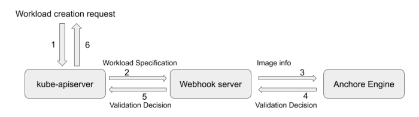

 
 


<table>
<tr>
<td>
Install anchor-engine with<br>helm
<td>

``` bash
helm install anchore -f anchore_values.yaml anchore/anchore-engine
```

<tr>
<td>
Configure <br>anchore-cli
<td>

``` bash
ANCHORE_CLI_USER=admin
ANCHORE_CLI_PASS=$(kubectl get secret --namespace default anchore-anchore-engine-admin-pass -o jsonpath="{.data.ANCHORE_ADMIN_PASSWORD}" | base64 --decode; echo)
ANCHORE_CLI_URL=http://anchore-anchore-engine-api.default.svc.cluster.local:8228/v1/

```

<tr>
<td>
Run anchore-cli
<td>

``` bash
kubectl run -it anchore-cli --restart=Always --image anchore/engine-cli  --env ANCHORE_CLI_USER=admin --env ANCHORE_CLI_PASS=${ANCHORE_CLI_PASS} --env ANCHORE_CLI_URL=${ANCHORE_CLI_URL}

```


<tr>
<td>Check current policies
<td>

``` bash
anchore-cli policy list
```

```bash
Policy ID                                   Active        Created                     Updated
2c53a13c-1765-11e8-82ef-23527761d060        True          2021-09-26T12:35:21Z        2021-09-26T12:35:21Z

```

``` bash
anchore-cli policy get 2c53a13c-1765-11e8-82ef-23527761d060 --detail
```

<details>
<summary>Click to expand default policy!</summary>

``` json
{
    "blacklisted_images": [],
    "comment": "Default bundle",
    "id": "2c53a13c-1765-11e8-82ef-23527761d060",
    "mappings": [
        {
            "id": "c4f9bf74-dc38-4ddf-b5cf-00e9c0074611",
            "image": {
                "type": "tag",
                "value": "*"
            },
            "name": "default",
            "policy_id": "48e6f7d6-1765-11e8-b5f9-8b6f228548b6",
            "registry": "*",
            "repository": "*",
            "whitelist_ids": [
                "37fd763e-1765-11e8-add4-3b16c029ac5c"
            ]
        }
    ],
    "name": "Default bundle",
    "policies": [
        {
            "comment": "System default policy",
            "id": "48e6f7d6-1765-11e8-b5f9-8b6f228548b6",
            "name": "DefaultPolicy",
            "rules": [
                {
                    "action": "STOP",
                    "gate": "dockerfile",
                    "id": "ce7b8000-829b-4c27-8122-69cd59018400",
                    "params": [
                        {
                            "name": "ports",
                            "value": "22"
                        },
                        {
                            "name": "type",
                            "value": "blacklist"
                        }
                    ],
                    "trigger": "exposed_ports"
                },
                {
                    "action": "WARN",
                    "gate": "dockerfile",
                    "id": "312d9e41-1c05-4e2f-ad89-b7d34b0855bb",
                    "params": [
                        {
                            "name": "instruction",
                            "value": "HEALTHCHECK"
                        },
                        {
                            "name": "check",
                            "value": "not_exists"
                        }
                    ],
                    "trigger": "instruction"
                },
                {
                    "action": "WARN",
                    "gate": "vulnerabilities",
                    "id": "6b5c14e7-a6f7-48cc-99d2-959273a2c6fa",
                    "params": [
                        {
                            "name": "max_days_since_sync",
                            "value": "2"
                        }
                    ],
                    "trigger": "stale_feed_data"
                },
                {
                    "action": "WARN",
                    "gate": "vulnerabilities",
                    "id": "3e79ea94-18c4-4d26-9e29-3b9172a62c2e",
                    "params": [],
                    "trigger": "vulnerability_data_unavailable"
                },
                {
                    "action": "WARN",
                    "gate": "vulnerabilities",
                    "id": "6063fdde-b1c5-46af-973a-915739451ac4",
                    "params": [
                        {
                            "name": "package_type",
                            "value": "all"
                        },
                        {
                            "name": "severity_comparison",
                            "value": "="
                        },
                        {
                            "name": "severity",
                            "value": "medium"
                        }
                    ],
                    "trigger": "package"
                },
                {
                    "action": "STOP",
                    "gate": "vulnerabilities",
                    "id": "b30e8abc-444f-45b1-8a37-55be1b8c8bb5",
                    "params": [
                        {
                            "name": "package_type",
                            "value": "all"
                        },
                        {
                            "name": "severity_comparison",
                            "value": ">"
                        },
                        {
                            "name": "severity",
                            "value": "medium"
                        }
                    ],
                    "trigger": "package"
                }
            ],
            "version": "1_0"
        }
    ],
    "version": "1_0",
    "whitelisted_images": [],
    "whitelists": [
        {
            "comment": "Default global whitelist",
            "id": "37fd763e-1765-11e8-add4-3b16c029ac5c",
            "items": [],
            "name": "Global Whitelist",
            "version": "1_0"
        }
    ]
}
```
</details>

<tr>
<td>List analyzed images
<td>

``` bash
anchore-cli image list
```
```bash
Full Tag                                                     Image Digest                                                                   Analysis Status
docker.io/alpine:3.2                                         sha256:ddac200f3ebc9902fb8cfcd599f41feb2151f1118929da21bcef57dc276975f9        analyzed
docker.io/alpine:latest                                      sha256:69704ef328d05a9f806b6b8502915e6a0a4faa4d72018dc42343f511490daf8a        analyzed
docker.io/bitnami/nginx:latest                               sha256:afaf04cc59b499f50164c678d5f1711057f75486630fc4ff52d7756d16ebccb5        analyzed
docker.io/kaizheh/apache-struts2-cve-2017-5638:latest        sha256:381a90208031e7910555c99e7a88183389f5d159dcd118c2b98fd8ce196ab79e        analyzed
docker.io/kaizheh/nginx-docker:latest                        sha256:416b695b09a79995b3f25501bf0c9b9620e82984132060bf7d66d8776c1554b7        analyzed
docker.io/library/alpine:latest                              sha256:69704ef328d05a9f806b6b8502915e6a0a4faa4d72018dc42343f511490daf8a        analyzed
docker.io/ubuntu:latest                                      sha256:10cbddb6cf8568f56584ccb6c866203e68ab8e621bb87038e254f6f27f955bbe        analyzed
```


<tr>
<td>
Scan container image
<td>

``` bash
anchore-cli image add ubuntu
anchore-cli image list
```

<tr>
<td>
Describe Policies
<td>

``` bash
anchore-cli policy describe
anchore-cli policy describe --gate=licenses
anchore-cli policy describe --gate=dockerfile --trigger=exposed_ports

```


<tr>
<td>
Evaluating Images Against Policies
<td>

``` bash
anchore-cli evaluate check docker.io/kaizheh/apache-struts2-cve-2017-5638:latest --detail

```


<tr>
<td>
Evaluating status based on Digest or ID
<td>

``` bash
anchore-cli evaluate check docker.io/library/centos@sha256:191c883e479a7da2362b2d54c0840b2e8981e5ab62e11ab925abf8808d3d5d44 --tag=latest

```


<tr>
<td> Install admission controller
<td>



``` bash

sed 's@{{ANCHORE_CLI_URL}}@'"${ANCHORE_CLI_URL}"'@; s@{{ANCHORE_CLI_USER}}@'"${ANCHORE_CLI_USER}"'@; s@{{ANCHORE_CLI_PASS}}@'"${ANCHORE_CLI_PASS}"'@' image-scanning-admission-controller.yaml > image-scanning-admission-controller.yaml

kubectl apply -f image-scanning-admission-controller.yaml

kubectl get all -n image-scan-k8s-webhook-system

CA_BUNDLE=$(kubectl -n image-scan-k8s-webhook-system get secret image-scan-k8s-webhook-webhook-server-secret -o jsonpath='{.data.ca-cert\.pem}')
```

``` yaml
apiVersion: v1
kind: Namespace
metadata:
  labels:
    controller-tools.k8s.io: "1.0"
  name: image-scan-k8s-webhook-system
---
apiVersion: rbac.authorization.k8s.io/v1
kind: ClusterRole
metadata:
  creationTimestamp: null
  name: image-scan-k8s-webhook-manager-role
rules:
- apiGroups:
  - admissionregistration.k8s.io
  resources:
  - mutatingwebhookconfigurations
  - validatingwebhookconfigurations
  verbs:
  - get
  - list
  - watch
  - create
  - update
  - patch
  - delete
- apiGroups:
  - ""
  resources:
  - secrets
  verbs:
  - get
  - list
  - watch
  - create
  - update
  - patch
  - delete
- apiGroups:
  - ""
  resources:
  - services
  verbs:
  - get
  - list
  - watch
  - create
  - update
  - patch
  - delete
---
apiVersion: rbac.authorization.k8s.io/v1
kind: ClusterRoleBinding
metadata:
  creationTimestamp: null
  name: image-scan-k8s-webhook-manager-rolebinding
roleRef:
  apiGroup: rbac.authorization.k8s.io
  kind: ClusterRole
  name: image-scan-k8s-webhook-manager-role
subjects:
- kind: ServiceAccount
  name: default
  namespace: image-scan-k8s-webhook-system
---
apiVersion: v1
kind: Secret
metadata:
  name: image-scan-k8s-webhook-webhook-server-secret
  namespace: image-scan-k8s-webhook-system
---
apiVersion: v1
kind: Secret
metadata:
  name: sysdig-secure-token
  namespace: image-scan-k8s-webhook-system
type: Opaque
stringData:
  config.yaml: |-
      ANCHORE_CLI_USER: {{ANCHORE_CLI_USER}}
      ANCHORE_CLI_PASS: {{ANCHORE_CLI_PASS}}
      ANCHORE_CLI_URL: {{ANCHORE_CLI_URL}}
---
apiVersion: v1
kind: Service
metadata:
  labels:
    control-plane: controller-manager
    controller-tools.k8s.io: "1.0"
  name: image-scan-k8s-webhook-controller-manager-service
  namespace: image-scan-k8s-webhook-system
spec:
  ports:
  - port: 443
  selector:
    control-plane: controller-manager
    controller-tools.k8s.io: "1.0"
---
apiVersion: apps/v1
kind: StatefulSet
metadata:
  labels:
    control-plane: controller-manager
    controller-tools.k8s.io: "1.0"
  name: image-scan-k8s-webhook-controller-manager
  namespace: image-scan-k8s-webhook-system
spec:
  selector:
    matchLabels:
      control-plane: controller-manager
      controller-tools.k8s.io: "1.0"
  serviceName: image-scan-k8s-webhook-controller-manager-service
  template:
    metadata:
      labels:
        control-plane: controller-manager
        controller-tools.k8s.io: "1.0"
    spec:
      containers:
      - command:
        - /root/manager
        env:
        - name: POD_NAMESPACE
          valueFrom:
            fieldRef:
              fieldPath: metadata.namespace
        - name: SECRET_NAME
          value: image-scan-k8s-webhook-webhook-server-secret
        - name: REJECT_IF_TIMEOUT
          value: "false"
        image: docker.io/sysdig/sysdig-image-scanning-trigger:latest
        imagePullPolicy: Always
        name: manager
        ports:
        - containerPort: 9876
          name: webhook-server
          protocol: TCP
        resources:
          limits:
            cpu: 200m
            memory: 200Mi
          requests:
            cpu: 100m
            memory: 100Mi
        volumeMounts:
        - mountPath: /tmp/cert
          name: cert
          readOnly: true
        - mountPath: /tmp/sysdig-token
          name: sysdig-token
          readOnly: true
      terminationGracePeriodSeconds: 10
      volumes:
      - name: cert
        secret:
          defaultMode: 420
          secretName: image-scan-k8s-webhook-webhook-server-secret
      - name: sysdig-token
        secret:
          defaultMode: 420
          secretName: sysdig-secure-token

```


<tr>
<td>Register webhook
<td>

``` bash
sed 's@{{CA_BUNDLE}}@'"${CA_BUNDLE}"'@' generic-validatingewebhookconfig.yaml > generic-validatingewebhookconfig.yaml

kubectl apply -f generic-validatingewebhookconfig.yaml

kubectl get ValidatingWebhookConfiguration
```

``` yaml
apiVersion: admissionregistration.k8s.io/v1beta1
kind: ValidatingWebhookConfiguration
metadata:
  name: validating-webhook-configuration
webhooks:
- name: validating-create-pods.k8s.io
  clientConfig:
    service:
      namespace: image-scan-k8s-webhook-system
      name: webhook-server-service
      path: /validating-create-pods
    caBundle: {{CA_BUNDLE}}
  rules:
  - operations:
    - CREATE
    apiGroups:
    - ""
    apiVersions:
    - "v1"
    resources:
    - pods
  failurePolicy: Fail
  ```


<tr>
<td>Test default policies
<td>

``` bash
kubectl run --image=kaizheh/apache-struts2-cve-2017-5638 --restart=Never apache-struts2 

Error from server (Image failed policy check: kaizheh/apache-struts2-cve-2017-5638 ): admission webhook "validating-create-pods.k8s.io" denied the request: Image failed policy check: kaizheh/apache-struts2-cve-2017-5638

```

<tr>
<td> Create custom policy
<td>

``` bash
Check if debian(stable & unstable) are passing default policy:

anchore-cli evaluate check docker.io/library/debian:stable

Image Digest: sha256:091d2ab48e67c85d3dfa5462d6c68ce84348a88f448f22094b83e043f28c3060
Full Tag: docker.io/library/debian:stable
Status: pass
Last Eval: 2021-09-28T19:02:47Z
Policy ID: 2c53a13c-1765-11e8-82ef-23527761d060
```

```bash
anchore-cli evaluate check docker.io/library/debian:unstable

Image Digest: sha256:82ddff7e4a4f15e82f9f7af055a4e8b353ee78d6bfd0d15814febaad475ad29e
Full Tag: docker.io/library/debian:unstable
Status: pass
Last Eval: 2021-09-28T19:02:54Z
Policy ID: 2c53a13c-1765-11e8-82ef-23527761d060
```

```bash
Activate custom policy
anchore-cli policy activate default0
```

```bash
evaluate check docker.io/library/debian:stable

Image Digest: sha256:091d2ab48e67c85d3dfa5462d6c68ce84348a88f448f22094b83e043f28c3060
Full Tag: docker.io/library/debian:stable
Status: pass
Last Eval: 2021-09-28T19:05:06Z
Policy ID: default0
```

```bash
anchore-cli evaluate check docker.io/library/debian:unstable
Image Digest: sha256:82ddff7e4a4f15e82f9f7af055a4e8b353ee78d6bfd0d15814febaad475ad29e
Full Tag: docker.io/library/debian:unstable
Status: fail
Last Eval: 2021-09-28T19:05:11Z
Policy ID: default0
```

``` json
{
  "id": "default0",
  "version": "1_0",
  "name": "My Default bundle",
  "comment": "My system's default bundle",
  "whitelisted_images": [
    {
      "name": "WhitelistDebianStable",
      "registry": "docker.io",
      "repository": "library/debian",
      "image": { "type": "tag", "value": "stable" }
    }
  ],
  "blacklisted_images": [
    {
      "name": "BlacklistDebianUnstable",
      "registry": "docker.io",
      "repository": "library/debian",
      "image": { "type": "tag", "value": "unstable" }
    }
  ],
  "mappings": [
    {
      "name": "DockerHub", 
      "registry": "docker.io",
      "repository": "library/postgres",
      "image": { "type": "tag", "value": "latest" },
      "policy_ids": [ "policy1", "policy2" ],
      "whitelist_ids": [ "whitelist1", "whitelist2" ]
    },
    {
      "name": "default", 
      "registry": "*",
      "repository": "*",
      "image": { "type": "tag", "value": "*" },
      "policy_ids": [ "policy1" ],
      "whitelist_ids": [ "whitelist1" ]
    }
  ],
  "whitelists": [
    {
      "id": "whitelist1",
      "name": "Simple Whitelist",
      "version": "1_0",
      "items": [
        { "id": "item1", "gate": "vulnerabilities", "trigger": "package", "trigger_id": "CVE-10000+libssl" },
        { "id": "item2", "gate": "vulnerabilities", "trigger": "package", "trigger_id": "CVE-10001+*" }
      ]
    },
    {
      "id": "whitelist2",
      "name": "Simple Whitelist",
      "version": "1_0",
      "items": [
        { "id": "item1", "gate": "vulnerabilities", "trigger": "package", "trigger_id": "CVE-1111+*" }
      ]
    }
  ],
  "policies": [
    {
      "name": "DefaultPolicy",
      "version": "1_0",
      "comment": "Policy for basic checks",
      "id": "policy1",
      "rules": [
        {
          "action": "STOP",
          "gate": "vulnerabilities",
          "trigger": "package",
          "id": "rule1",
          "params": [
            { "name": "package_type", "value": "all" },
            { "name": "severity_comparison", "value": ">=" },
            { "name": "severity", "value": "medium" }
          ]
        }
      ]
    },
    {
      "name": "DBPolicy",
      "version": "1_0",
      "comment": "Policy for basic checks on a db",
      "id": "policy2",
      "rules": [
        {
          "action": "STOP",
          "gate": "vulnerabilities",
          "trigger": "package",
          "id": "rule1",
          "params": [
            { "name": "package_type", "value": "all" },
            { "name": "severity_comparison", "value": ">=" },
            { "name": "severity", "value": "low" }
          ]
        }
      ]
    }
  ]
}
```

<!--<tr>
<td>
<td>
``` bash

``` -->

</table>